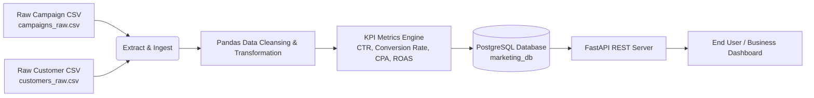

# Marketing Analytics & Customer Data Pipeline

A production-ready end-to-end **Marketing Analytics & Customer Data Pipeline** built using **Python (Pandas & SQLAlchemy)**, **PostgreSQL**, **FastAPI**, and **Docker**.

Designed for marketing analytics, data engineering, and software engineering portfolios. It extracts raw campaign and customer interaction datasets, cleanses and transforms raw data, computes critical marketing performance KPIs, stores analytics in PostgreSQL, and exposes a high-performance RESTful API.

---

## 📊 Pipeline Architecture & Workflow



---

## 🚀 Key Features & Computed Marketing Metrics

1. **Automated ETL Pipeline**:
   - **Data Cleaning**: Strips whitespace, normalizes multi-channel labels (Meta, Google Ads, TikTok, etc.), removes duplicate records, and parses date formats.
   - **Handling Missing Values**: Fills missing metrics safely without dropping critical attribution records.
2. **Calculated Business KPIs**:
   - **CTR (Click-Through Rate)**: $\text{CTR (\%)} = \left(\frac{\text{Clicks}}{\text{Impressions}}\right) \times 100$
   - **Conversion Rate**: $\text{Conversion Rate (\%)} = \left(\frac{\text{Conversions}}{\text{Clicks}}\right) \times 100$
   - **CPA (Cost Per Acquisition)**: $\text{CPA (\$)} = \frac{\text{Spend}}{\text{Conversions}}$
   - **ROAS (Return on Ad Spend)**: $\text{ROAS} = \frac{\text{Total Revenue}}{\text{Spend}}$
3. **Database & SQL Views**:
   - relational schema linking customer conversions to campaigns.
   - Analytical SQL view (`view_channel_performance`) for fast aggregated reporting.
4. **FastAPI REST Service**:
   - Fully documented interactive OpenAPI/Swagger UI at `/docs`.
   - Real-time queries with channel filtering, customer pagination, and executive metrics.
5. **Dockerized Environment**:
   - One-command startup via Docker Compose with health checks and persistent storage.

---

## 📁 Project Directory Structure

```
dataPipeline/
├── data/
│   ├── campaigns_raw.csv           # Raw sample campaign performance data
│   └── customers_raw.csv           # Raw customer interaction & attribution data
├── db/
│   ├── schema.sql                  # PostgreSQL table definitions & analytical views
│   └── connection.py               # SQLAlchemy database engine connection manager
├── etl/
│   ├── extract.py                  # Ingestion logic for CSV datasets
│   ├── transform.py                # Cleaning logic & metric calculations
│   └── load.py                     # Database loading module
├── api/
│   └── main.py                     # FastAPI REST API endpoints
├── tests/
│   ├── test_transform.py           # Pytest unit tests for ETL logic
│   └── test_api.py                 # Pytest integration tests for REST API
├── run_pipeline.py                 # Main CLI entrypoint to execute ETL
├── Dockerfile                      # Container build manifest
├── docker-compose.yml              # Multi-container setup (Postgres + API)
├── requirements.txt                # Python package dependencies
└── README.md                       # Project documentation
```

---

## ⚡ Quickstart Guide

### Option 1: Run with Docker (Recommended)

1. Clone or navigate to the repository directory:
   ```bash
   cd dataPipeline
   ```

2. Start PostgreSQL and the Python API service using Docker Compose:
   ```bash
   docker-compose up --build
   ```

3. Access the REST API & interactive documentation:
   - **API Documentation (Swagger UI)**: [http://localhost:8000/docs](http://localhost:8000/docs)
   - **Executive Summary API**: [http://localhost:8000/api/metrics/summary](http://localhost:8000/api/metrics/summary)

---

### Option 2: Run Locally (Python Virtual Environment)

1. Create and activate a Python virtual environment:
   ```bash
   python -m venv venv
   source venv/bin/activate  # On Windows: venv\Scripts\activate
   ```

2. Install dependencies:
   ```bash
   pip install -r requirements.txt
   ```

3. Run the ETL Pipeline (creates a local SQLite database if Postgres is not running):
   ```bash
   python run_pipeline.py
   ```

4. Start the FastAPI REST API server:
   ```bash
   uvicorn api.main:app --reload --port 8000
   ```

5. Open [http://localhost:8000/docs](http://localhost:8000/docs) in your browser.

---

## 🔌 REST API Endpoints Reference

| Method | Endpoint | Description | Query Parameters |
| :--- | :--- | :--- | :--- |
| `GET` | `/` | API Healthcheck & metadata | None |
| `GET` | `/api/metrics/summary` | Executive Marketing Dashboard KPIs | None |
| `GET` | `/api/campaigns` | List all campaign metrics | `channel` (optional filter) |
| `GET` | `/api/campaigns/{id}` | Get specific campaign performance by ID | None |
| `GET` | `/api/customers` | Customer acquisition & conversion data | `converted` (bool), `limit`, `offset` |
| `GET` | `/api/channels` | Aggregated metrics grouped by channel | None |

---

## 🧪 Running Automated Tests

Run the test suite using `pytest`:

```bash
pytest tests/ -v
```

Tests cover:
- Campaign & customer data cleaning logic
- Accurate calculation of CTR, Conversion Rate, CPA, and ROAS
- FastAPI response codes, json payload structure, and query filter functionality

---

## 🗄️ Database Schema Overview

- **`campaigns`**: Master table storing ad spend, impressions, clicks, channel, and timeline.
- **`customers`**: Transaction table holding customer demographics, campaign attribution, and order values.
- **`campaign_metrics`**: Analytical table with computed performance indicators.
- **`view_channel_performance`**: SQL view aggregating performance metrics by channel.
